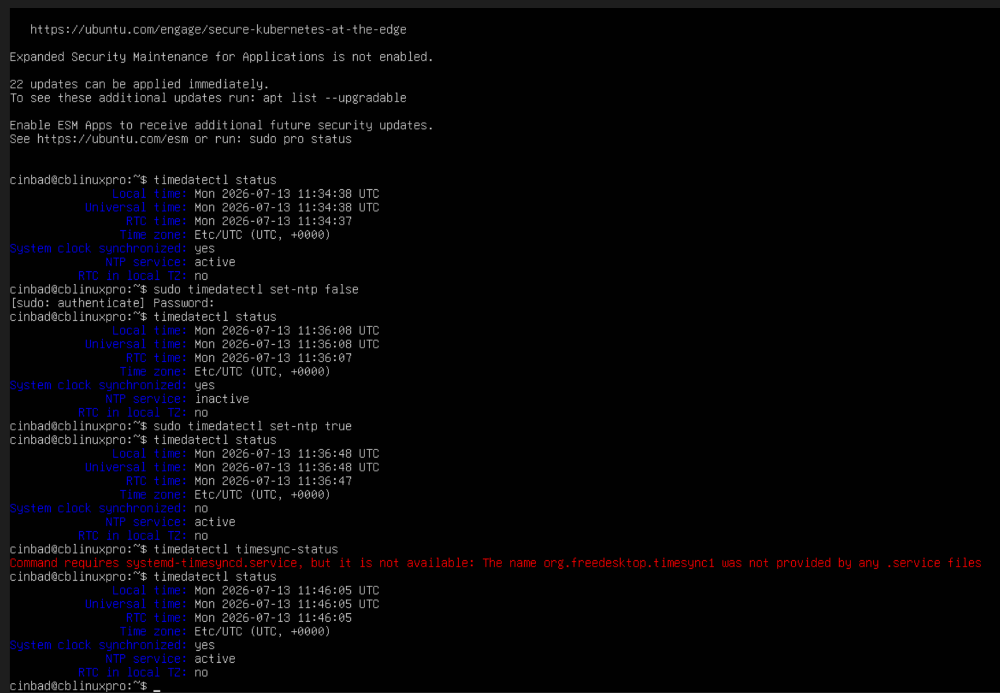
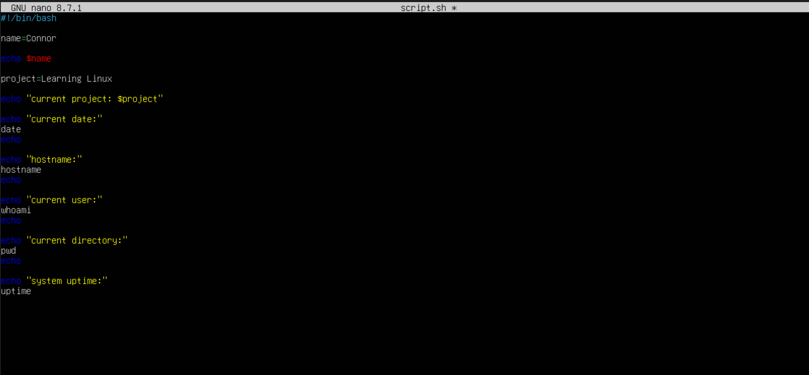
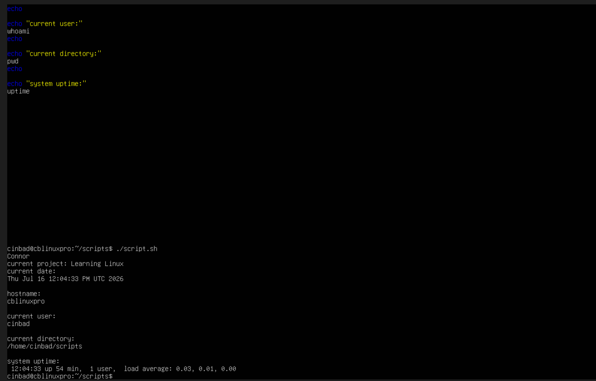
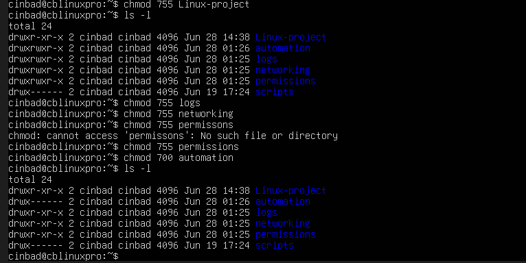
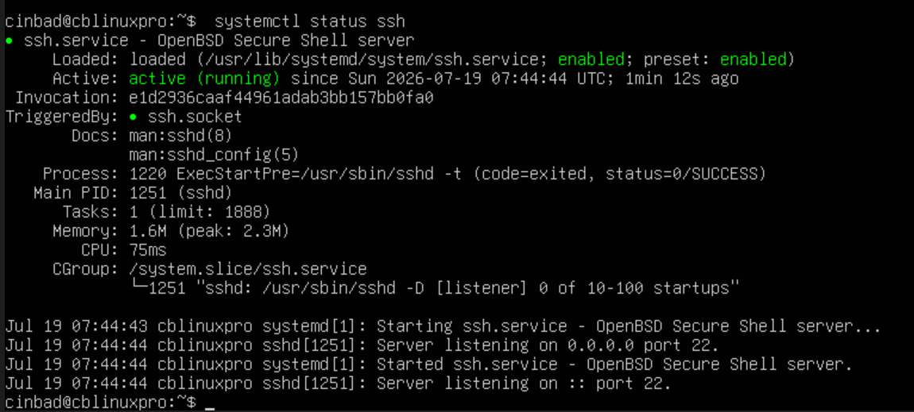
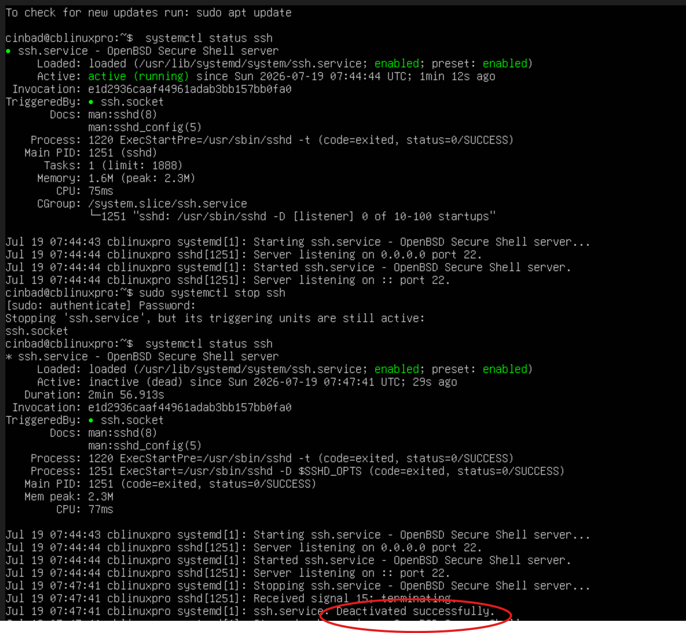
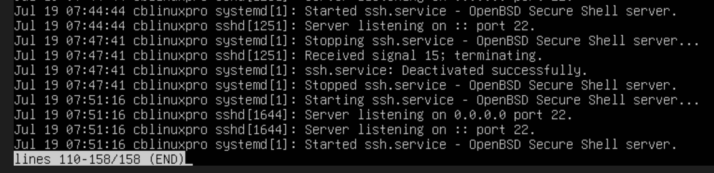
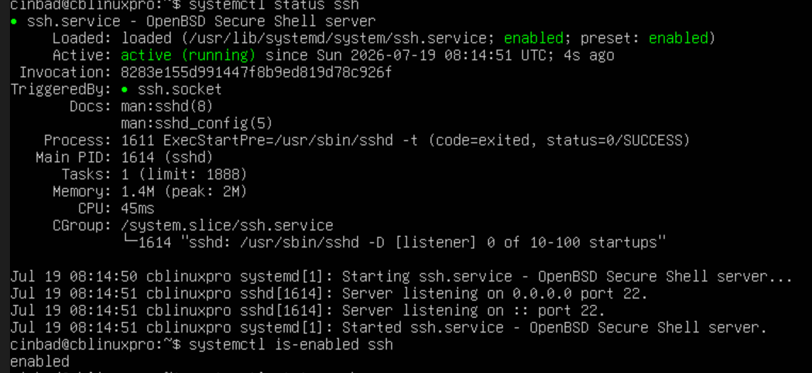

# Learning Linux Project

Personal Linux learning project focused on Linux administration,
permissions, scripting, troubleshooting and automation.

---

## Planned Next Steps

- expand the enviroment into a multi machine network (P2P)
- configure SSH communication between VMs
- practice client/server networking
- explore firewall rules and network troubleshooting
- continued improvement on system monitoring and scripting

## Current Topics

- Linux commands
- File permissions
- Bash scripting
- Process and service management
- Networking basics
- Troubleshooting

---

## Current Progress

Completed:
- VM setup
- Time synchronization troubleshooting
- Basic bash scripts
- chmod permissions
- Directory structures
- system-info.sh script
- Services
- Process management

Currently learning:
- Process management
- Services
- Logging

---

## Project Structure

automation/
logs/
networking/
permissions/
scripts/
---

## Project-Notes
(screenshots will be added to my screenshot folder-ongoing)

---

### commands

- pwd= where am i?
- ls= whats here?
--- ls variants ls -l,ls -a,ls -la
- mkdir= make directory/ folder
- touch= make file 
- cat= view file/quick look
- cp= copy file /folder
- mv= move/rename file
- rm = delete file
- ps aux= identifies user activity 
- systemd= service manager- daemon
- chronyd= time sync service- daemon
- bash= active shell session
- top= system mionitoring tool- cpu / memory usage
- htop= easier to read top

---

### VM clock sync troubleshooting
During my originalsetup of the Ubuntu VM and runnuing some basic scripts, i noticed vm's clock was not synchronising correctly.
looked into the issue to filtered and diagnos the issue

#### Goal
To get the Vm's clock working correctly, so i can update/upgrade the machine

#### Ivestigation
- i first used journalctl | grep -i time to see what was installed under time 
- then verified the state of the clock with timedatectl status
- aftrer that i then turned off the NTP server with sudo timedatectl set-ntp false then used timedatectl again to make sure its definately turned off
- then switched it back on sudo timedatectl set-ntp true which booted the ntp server back up to the correct date

 #### problem

 after the investigation, i used timedatectl and realised that the clock still wasn't synced which initailly lead me to worry.
 
 #### resolution
However, it was just a realisation on my part that when flipping the ntp server on and off that the time service might take a minute or two before reaching the NTP server and confirming that the clock is synced and when using timedatectl the clock synchronisation status showed as "yes"
 
 
 #### What i learned
- how to troubleshoot time sync issues using timedatectl
- the difference between an active NTP server and a synchronised clock
- why linux server depend on time accuracy
- eventually this problem came up again making the ntp on and off an almost temporary solution and the permanent solution was the way i logged out the VM using save state rather than sudo shutdown now

 
 
 
  
 
 
### scripting

During this project i wanted to reduce the amount of repetitive cammands i had to type everytime i logged into my VM. 

#### Goal

- Learn and format basic bash scripting
- understabd executable permissons
- begin to transition from the idea of learning commands to optimising sacripts for workflow
  
#### Commands used

- echo
- date
- hostname
- whoami
- pwd
- uptime
- chmod +x - makes files runnable
- ./- runs file

#### what i learned

- shebang (#!/bin/bash)- execute the script using bash shell
- varibles and expansions- name= connor,$name ,$project
- echo can print both plain text and variables
- how to apply permissons to make a file into a script
- how to look for opportunities to shave time off a workload

  
  ---
  
### Permission Values

- d= directory
- -= file
-  r=read=4
-  w=write=2
-  x= execute=1
-  0=do nothing
-  7=4+2+1=rwx
-  6=4+2=rw
-  5=4+1=r-x
-  chmod 700 = rwx, do nothing,do nothing
-  644=read/write
-  755=onwer has full control others can only read and execute but not edit

while learning i experimented with different permission values to add to my topic directories using chmod, using ls -l to verify each change.

  #### what i learned 

In the original practical learning phase of beginner linux labs, permissions felt the hardest for me to conceptualize 
not compeletely uhderstading the numerical system and just kind of followed the examples. Whereas now after creating these scenarios for myself in my own machine its really helped me understand why these permissions levels are used and how i can read them with ls -l. 
  
  
  
  
  
  ---
  

  ### Processes and Management

- daemon = background service that runs continously without user interaction
- systemctl status = view serivice status
-  ...ctl restart =  restart a service
-  ...ctl stop = stop a service
-  ...ctl start = start a service
-  ...ctl is enabled= checks if service is active

#### Goal

how a service are managed abd how to verify change

#### commands used 

- systemctl status ssh
- systemctl stop ssh
- systemctl start ssh
- systemctl restart ssh
- systemctl is-enabled ssh
- journalctl -u ssh

#### what i observed

- Got confortable with viewing the status the green highlights made it easy enough to verify the ssh is enabled and active
  

- stopped the ssh service and compared how the status of the service looked before and now. I think my own logic threw me off for a minute given how the ssh service and preset are stil green but then noticed two main factors of the service no longer being active, main one that it didnt have the additional green text of running and then at the bottom it has recent traffic log confirming its deactivation.

- Then i used journalctl to get a feeling of what the next subject of logging would feel like and looked at the recent service activity. looking at the timestamps i can see when the commands i used affected the change in the service.

-then i restarted the service and vhecked the status again and compared it to my first screenshot and seems to be in the same state as before and then used the is-enabled command that confimrs the status of the service which fed back enabled

#### what i learned

That using system logs is always concrete proof that of a services health and state and its better to check the service as whole than use a stop and start command and just assume its state. Found this exercise as a healthly habit to build upon as i can see it as the starting point for many trouble shooting scenarios.  

---

 ### Logging

#### Goal

understand how to filter logs

 

 #### Commands used
 - history= inputs logged in session
 - journalctl
 - ... -xe 
 - ... -u ssh 
 - ... -b 
 - ... -p warning
 -  -p = priority
   

 #### what i learned

 learned how to alter the standard to journalctl command to fit a specfic task. journalctl -p warning only shows events that are of a certain level (warning) and prioritises them. 
 -xe gives additional gives more information on recent logs and would be effective stituations like a reoccuring crash.
 journalctl -u can filter to a specfic service like in process and mangement when i was viewing the ssh status. Overall this element of linux i most like my current job using SAp so a lot of it clicked right away its just about getting used to what to search and filter for in specific tasks,  
  
   ---

   ### Networking

- resolver=translates domain names into ip
- ARP=ip to find MAc
- hostname= host machine
- 127.0.0.1= loopback/ local host
- ping google
- ping 8.8.8.8
- curl= to transfer /download data from servers
- ipconfig.me= website that returns your public address
- ip a= network interface and ip address
- ss tuln= linux netstat equivelent shows listening ports
- port 22= default network port used by ssh
- ip route= routing table / default gateway
- cat/etc/resolv.conf= shows dns resolver configurations
- systemctl status ssh = checks ssh status
- sudo systemctl stop/ start ssh= stops /starts ssh
- sudo .... enable/disable ssh= shuts off or gets ssh back up and running
- ssh localhost= tests if your local host is working
- ssh-keygen= generates authentication keys
- ip neigh= shows neighbouring devices 
- reachable= device confirmed actice
- stale = device known but inactive
- failed = device unreachable

 ---

### automation
---
