# Learning Linux Project

Personal Linux learning project focused on Linux administration,
permissions, scripting, troubleshooting and automation.

---

## Planned Next Steps

- expand the enviroment into a multi machine network (P2P)
- configure SSH communication between VMs
- practice client/server networking
- explore firewall rules and network troubleshooting
- continued improvement on system monitoring and scripting

## Current Topics

---

## Current Progress

Completed:
- VM setup
- Time synchronization troubleshooting
- Basic bash scripts
- chmod permissions
- Directory structures
- system-info.sh script
- Services
- Process management
- Process management
- Services
- Logging
- SSH key generation

Currently learning:

---

## Project Structure

Automation/
Logs/
Networking/
Process and Management/
Permissions/
Scripts/
---

## Project-Notes

---

### Commands

- pwd= where am i?
- ls= whats here?
--- ls variants ls -l,ls -a,ls -la
- mkdir= make directory/ folder
- touch= make file 
- cat= view file/quick look
- cp= copy file /folder
- mv= move/rename file
- rm = delete file
- ps aux= identifies user activity 
- systemd= service manager- daemon
- chronyd= time sync service- daemon
- bash= active shell session
- top= system mionitoring tool- cpu / memory usage
- htop= easier to read top

---

### VM clock sync troubleshooting
During my originalsetup of the Ubuntu VM and runnuing some basic scripts, i noticed vm's clock was not synchronising correctly.
looked into the issue to filtered and diagnos the issue

#### Goal
To get the Vm's clock working correctly, so i can update/upgrade the machine

#### Ivestigation
- i first used journalctl | grep -i time to see what was installed under time 
- then verified the state of the clock with timedatectl status
- aftrer that i then turned off the NTP server with sudo timedatectl set-ntp false then used timedatectl again to make sure its definately turned off
- then switched it back on sudo timedatectl set-ntp true which booted the ntp server back up to the correct date

 #### problem

 after the investigation, i used timedatectl and realised that the clock still wasn't synced which initailly lead me to worry.
 
 #### resolution
However, it was just a realisation on my part that when flipping the ntp server on and off that the time service might take a minute or two before reaching the NTP server and confirming that the clock is synced and when using timedatectl the clock synchronisation status showed as "yes"
 
 
 #### What i learned
- how to troubleshoot time sync issues using timedatectl
- the difference between an active NTP server and a synchronised clock
- why linux server depend on time accuracy
- eventually this problem came up again making the ntp on and off an almost temporary solution and the permanent solution was the way i logged out the VM using save state rather than sudo shutdown now

 
 
 
  
 
 
### scripting

During this project i wanted to reduce the amount of repetitive cammands i had to type everytime i logged into my VM. 

#### Goal

- Learn and format basic bash scripting
- understabd executable permissons
- begin to transition from the idea of learning commands to optimising sacripts for workflow
  
#### Commands used

- echo
- date
- hostname
- whoami
- pwd
- uptime
- chmod +x - makes files runnable
- ./- runs file

#### what i learned

- shebang (#!/bin/bash)- execute the script using bash shell
- varibles and expansions- name= connor,$name ,$project
- echo can print both plain text and variables
- how to apply permissons to make a file into a script
- how to look for opportunities to shave time off a workload

  
  ---
  
### Permission Values

- d= directory
- -= file
-  r=read=4
-  w=write=2
-  x= execute=1
-  0=do nothing
-  7=4+2+1=rwx
-  6=4+2=rw
-  5=4+1=r-x
-  chmod 700 = rwx, do nothing,do nothing
-  644=read/write
-  755=onwer has full control others can only read and execute but not edit

while learning i experimented with different permission values to add to my topic directories using chmod, using ls -l to verify each change.

  #### what i learned 

In the original practical learning phase of beginner linux labs, permissions felt the hardest for me to conceptualize 
not compeletely uhderstading the numerical system and just kind of followed the examples. Whereas now after creating these scenarios for myself in my own machine its really helped me understand why these permissions levels are used and how i can read them with ls -l. 
  
  
  
  
  
  ---
  

  ### Processes and Management

- daemon = background service that runs continously without user interaction
- systemctl status = view serivice status
-  ...ctl restart =  restart a service
-  ...ctl stop = stop a service
-  ...ctl start = start a service
-  ...ctl is enabled= checks if service is active

#### Goal

how a service are managed abd how to verify change

#### commands used 

- systemctl status ssh
- systemctl stop ssh
- systemctl start ssh
- systemctl restart ssh
- systemctl is-enabled ssh
- journalctl -u ssh

#### what i observed

- Got confortable with viewing the status the green highlights made it easy enough to verify the ssh is enabled and active
  

- stopped the ssh service and compared how the status of the service looked before and now. I think my own logic threw me off for a minute given how the ssh service and preset are stil green but then noticed two main factors of the service no longer being active, main one that it didnt have the additional green text of running and then at the bottom it has recent traffic log confirming its deactivation.

- Then i used journalctl to get a feeling of what the next subject of logging would feel like and looked at the recent service activity. looking at the timestamps i can see when the commands i used affected the change in the service.

-then i restarted the service and vhecked the status again and compared it to my first screenshot and seems to be in the same state as before and then used the is-enabled command that confimrs the status of the service which fed back enabled

#### what i learned

That using system logs is always concrete proof that of a services health and state and its better to check the service as whole than use a stop and start command and just assume its state. Found this exercise as a healthly habit to build upon as i can see it as the starting point for many trouble shooting scenarios.  

---

 ### Logging

#### Goal

understand how to filter logs

 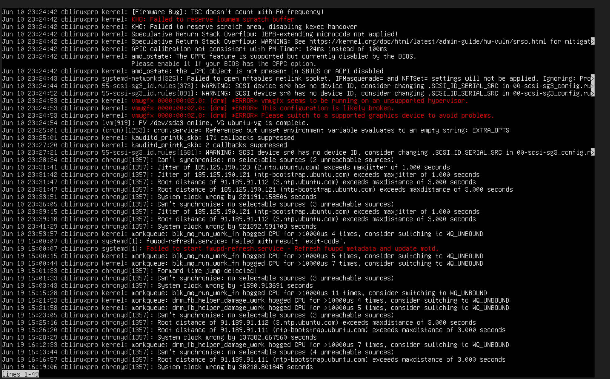

 #### Commands used
 - history= inputs logged in session
 - journalctl
 - ... -xe 
 - ... -u ssh 
 - ... -b 
 - ... -p warning
 -  -p = priority
   

 #### what i learned

 learned how to alter the standard to journalctl command to fit a specfic task. journalctl -p warning only shows events that are of a certain level (warning) and prioritises them. 
 -xe gives additional gives more information on recent logs and would be effective stituations like a reoccuring crash.
 journalctl -u can filter to a specfic service like in process and mangement when i was viewing the ssh status. Overall this element of linux i most like my current job using SAp so a lot of it clicked right away its just about getting used to what to search and filter for in specific tasks. 
  
   ---

   ### Networking

#### commands used and general reminders

- 127.0.0.1= loopback/ local host
- ip addr
- hostname
- hostname -l
- ping google
- ping 8.8.8.8
- dig google.com
- ipconfig.me= website that returns your public address
- ip a= network interface and ip address
- ss tuln= linux netstat equivelent shows listening ports
- port 22= default network port used by ssh
- ip route= routing table / default gateway
- cat/etc/resolv.conf= shows dns resolver configurations
- ssh localhost= tests if your local host is working
- ssh-keygen= generates authentication keys
- ls ~/.ssh
- cat ~/.ssh/id_ed25519.pub
- ip neigh= shows neighbouring devices 
- reachable= device confirmed actice
- stale = device known but inactive
- failed = device unreachable

Networking is by far the largest topic im covering in this first project. Mainly to understand how kinux idenitifies interfaces and communicates with other devices as it'll be massively important going into my next project of builing a second vm and building a peer-to-peer network. 
  
#### Basic configuraion

 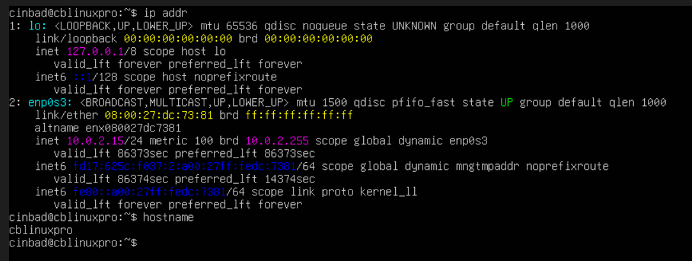

Used ip addr and hostname to find all the essitenals being the loopback,IPv4, MAC, an active interface and the hostname. This is important to know and understand when building into this next project becasue before the two machines can communicate correctly they first need the correct network configuration and i feel these would be the first troubleshhoting steps id take if the connection between the two machines broke in someway.

#### Testing connection

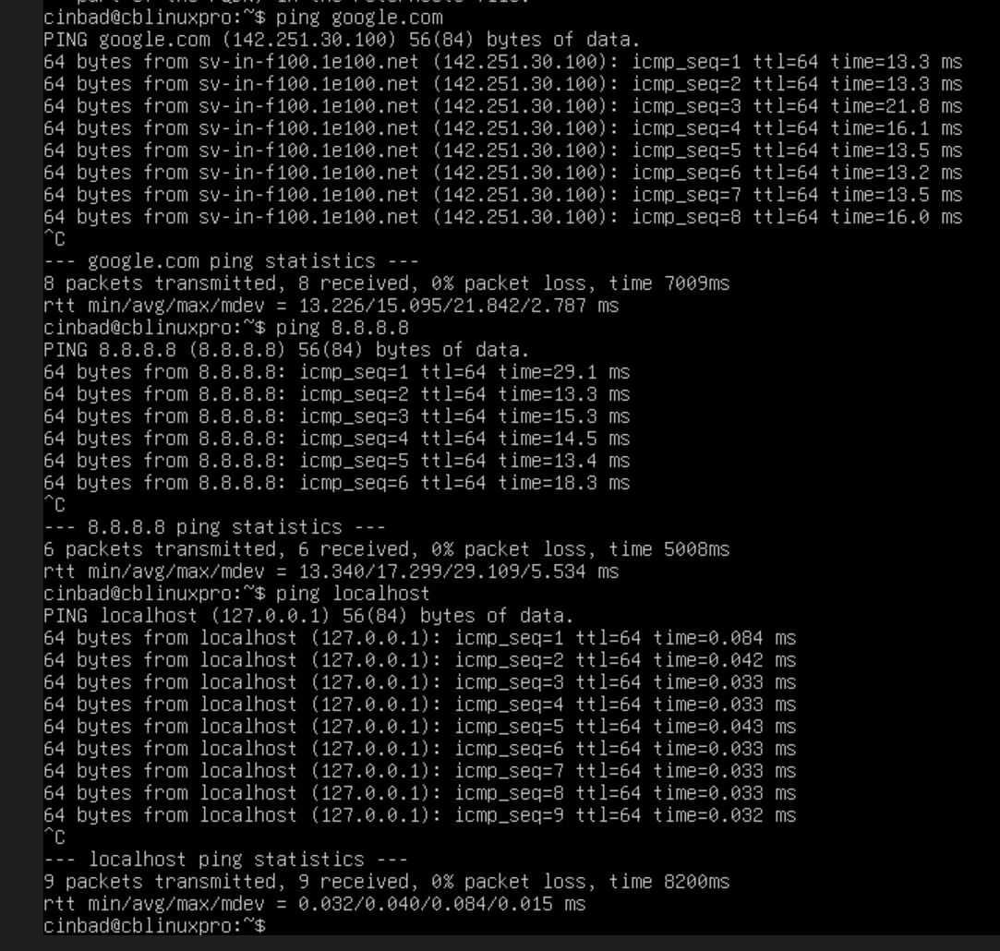

Here i used ping to test the loopback, raw Ip communication and the DNS/ internet connection. By doing this if and issue between the two VM's were to occur using the three ping commands of 8.8.8.8, Google.com and localhost isolates where the machines connect is going wrong.

#### Viewing Routing

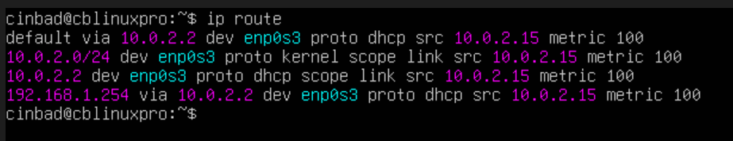

This is the routing table have a general understanding of it but will be much more important when that second vm connection is made and im able to see whats going on between the two machines.

#### Viewing Neighbouring devices

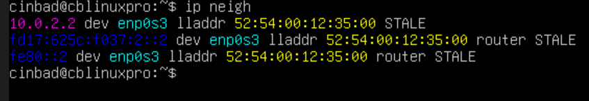

Similar agagin most of whats goiung on here will be better to guage when hopefully the neighbouring device on the network will be the second vm with its satus of being "REACHABLE".

#### DNS 

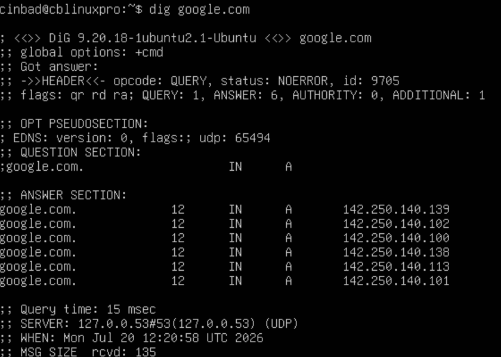

Used Dig here like the command it gave you very useful information by telling me the ip and which DNS gave me the answer. 

#### SSH Key Authentication

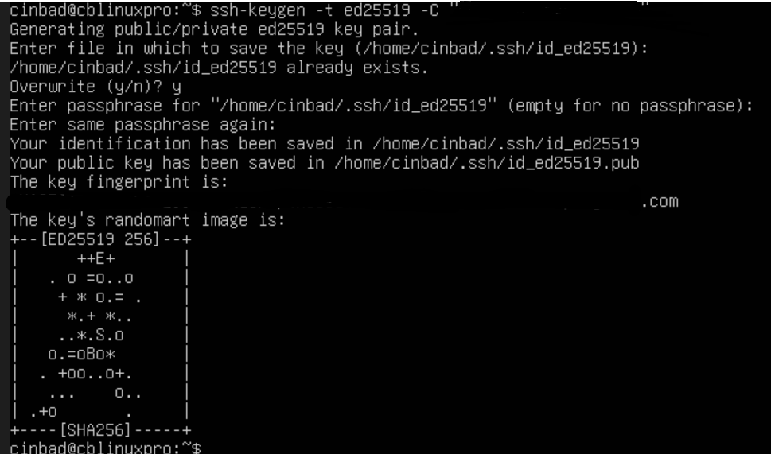

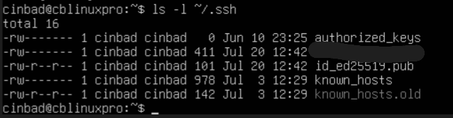

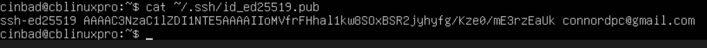

i wanted to learn how an authentication system worked in linux. Generating keys enabled me to do that generating a key pair and helped me understand how a remote authentication is established.
the key gen created two files one private and one public
After that i used Ls -l to confirm the keys creation before theb looking at the public key

#### How will this help in the upcoming project

This lays the foundation for the next project, all these networking topics covered from identifying unterfaces to establishing a passwordless connection between to vms  will be fundamental to building and managing a peer to peer network connection as you would see in a small business setting. 

 ---

### Automation

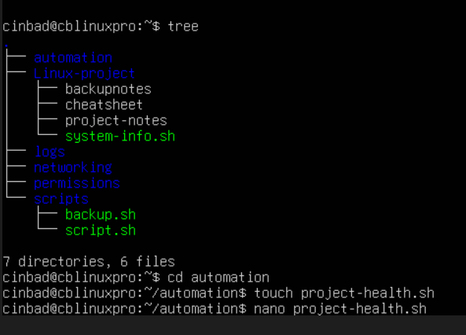
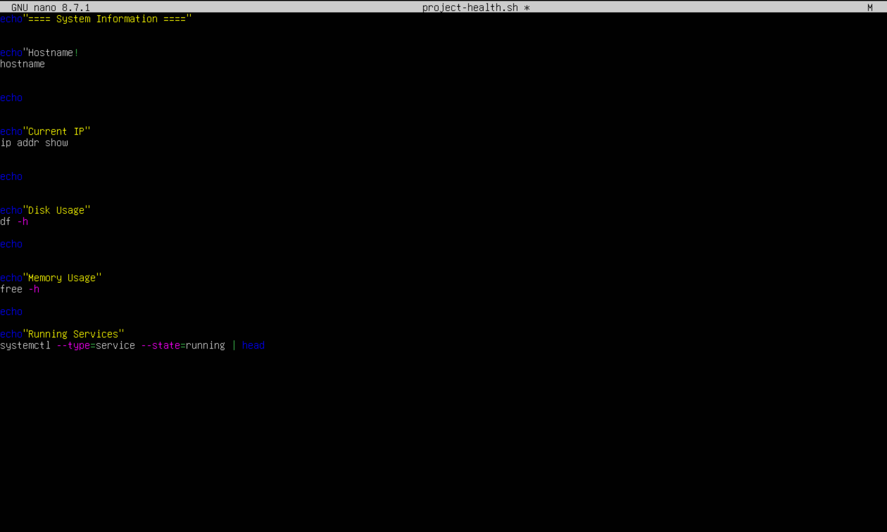
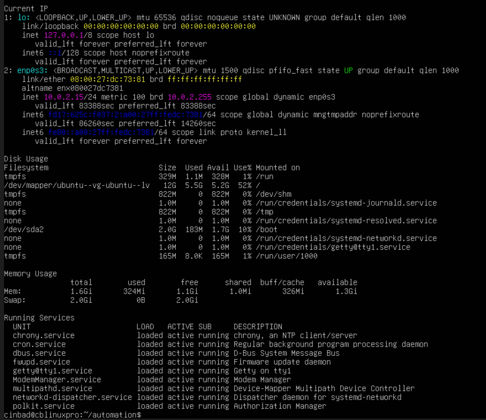

Built a script that does a bit more than my previous ones has more commands ive been learning recently that provide a decent level of utility. The full script reports the hostname, IP address,running services, disk and memory usage allowing me to cgeck the machines configuration and condition in one prompt, these types of check ups will be vital in my next project to help initial trubleshooting as well as scripts that can cut corners or at the very least make things easier.

### Project Summary

Overall, i think since i started learning about IT/ Networking back in january on a theory based level i was quite uncertain if i could really ever do well in a feild like this but i think since leaving the theory beginner certs and practice labs to creating something for myself in this project its made the world of a difference because i can just keep practicing things until they feel natural.
The part of the project i felt i struggled with the most is probably the learning curve of uding Github rather than anything i could've done in the VM, the formatting feels very strict alot like what you can deal with in a terminal and i held the documentating process off for a long while with Github i'd instead write up small thoughts up in a file in my VM up until maube Logging were i thought i got comfortable enough in linux to really try with Github.
What suprised me Most is how naturally i took to being able to read through logs, there is a connection to it at my current job were id have to do some investigative work to track an items movement on SAP regularly and this part just clicked with the logging work well. Something i became much more confident with compared to my knowledge prior was definately permission values, kearning the numerical codes top to bottomfelt so much simplier than what i made it out to be in the TryHackMe labs it looked veru overwheleming again questioning if i really could work in this type of feild but when i built all my directories and files and applied the permissions to them everything made sense. i think what will happen in my next project will be much bigger compared to this as this is mainly topic based it'll be more project based including the enviorments setup, network configuration, remote admin work, file transfers and more. i think if the next project gets the best of me and enables me to work at morre of an advance level, it'll only do right by me and hopefully better my chances of working in this type of field.  

---
